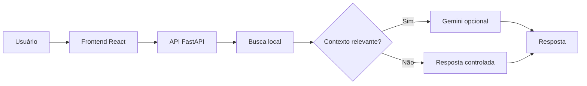
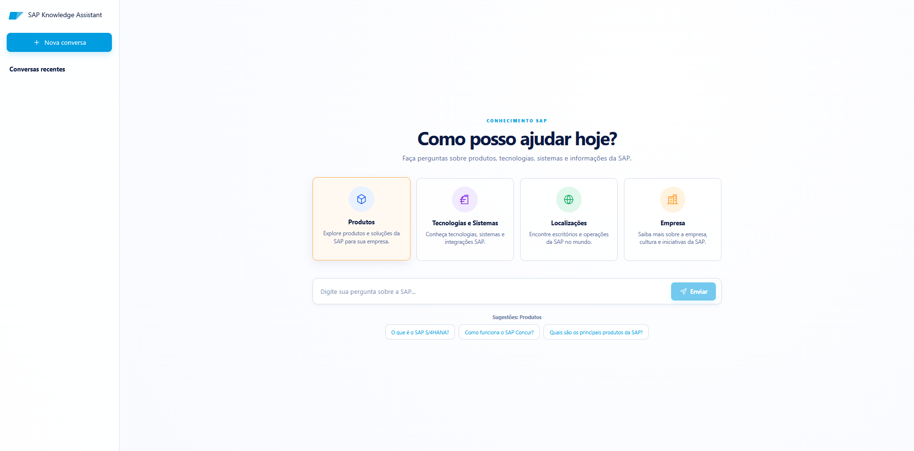
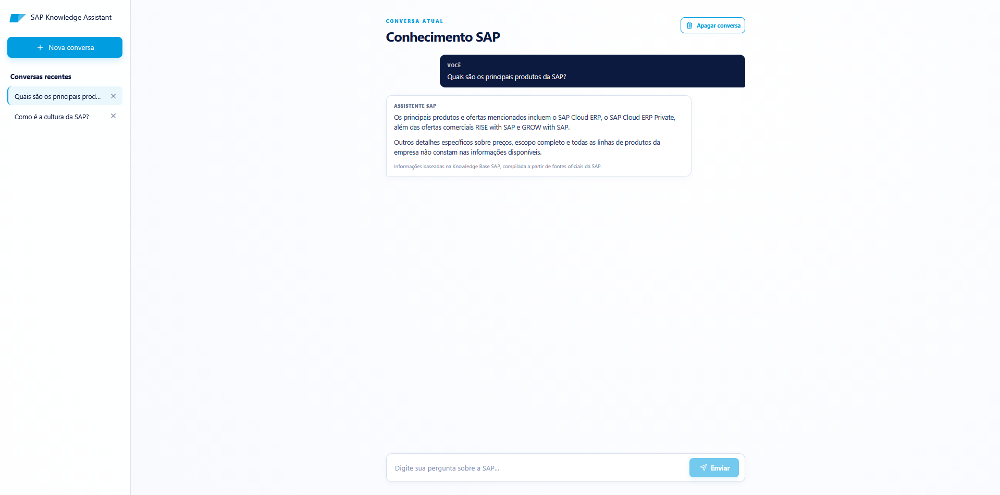
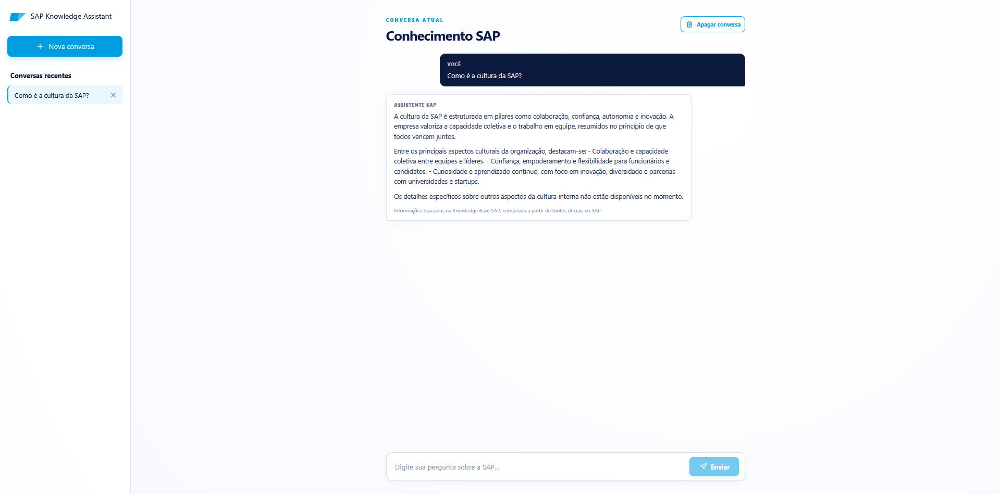
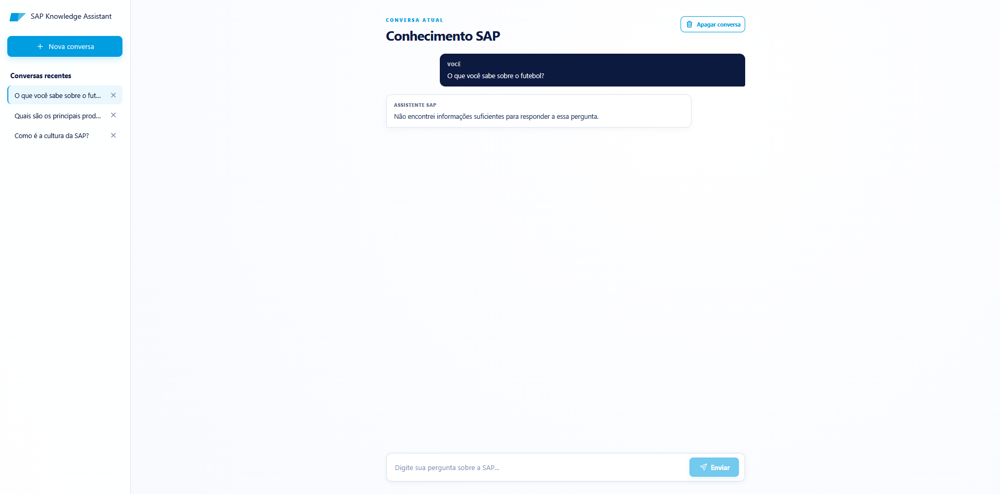

<div align="center">

# SAP Knowledge Assistant

Assistente para consultar informações sobre produtos, tecnologias, sistemas e a empresa SAP.

Este projeto combina uma Knowledge Base local com recuperação de informações e uso opcional do Google Gemini para responder perguntas sobre a SAP.

[**Acessar demonstração online**](https://sapknowledgeassistant.onrender.com)


</div>

## Visão geral do projeto

| Item | Descrição |
| --- | --- |
| Tipo de projeto | Assistente de conhecimento com RAG local |
| Objetivo | Responder perguntas sobre a SAP |
| Interface | Aplicação web em React |
| Backend | API em FastAPI |
| Base de conhecimento | PDFs e CSVs sobre a SAP |
| IA generativa | Google Gemini, usada quando necessário |
| Hospedagem | Render |

O SAP Knowledge Assistant responde perguntas usando documentos locais sobre a SAP. Antes de gerar uma resposta, ele procura trechos relacionados na Knowledge Base e mostra as fontes utilizadas. O Gemini pode ajudar a sintetizar esses trechos, mas só recebe contexto quando a busca local encontra material relevante.

## Navegação

| Seção | Conteúdo |
| --- | --- |
| [Visão geral](#visão-geral-do-projeto) | O que é o projeto |
| [Arquitetura](#arquitetura) | Como as partes se conectam |
| [Tecnologias](#tecnologias) | Ferramentas utilizadas |
| [Knowledge Base](#knowledge-base) | Documentos e dados utilizados |
| [Execução local](#execução-local) | Como rodar no computador |
| [Demonstração](#demonstração) | Imagens e acesso online |
| [Exemplos](#exemplos-de-uso) | Perguntas e respostas |
| [Testes](#testes) | Como validar o projeto |
| [Segurança](#segurança) | Tratamento de secrets |
| [Deploy](#deploy) | Hospedagem no Render |

## Arquitetura

O fluxo de uma pergunta é simples:

1. O usuário faz uma pergunta no frontend.
2. O frontend envia a pergunta para o backend.
3. O backend procura primeiro na Knowledge Base local.
4. PDFs e CSVs são carregados, limpos e divididos em chunks.
5. O retriever busca os trechos mais relacionados à pergunta.
6. O Gemini só é usado quando há contexto relevante e é necessária uma síntese.
7. A resposta, junto das fontes disponíveis, volta para o frontend.



O frontend não acessa a API Key e não chama o Gemini diretamente. A Knowledge Base é carregada pelo backend, e documentos completos não são enviados ao modelo.

## Tecnologias

- Python, FastAPI e Uvicorn no backend.
- React, TypeScript e Vite na interface.
- `pypdf` para leitura dos PDFs e o módulo `csv` da biblioteca padrão para os CSVs.
- Google Gen AI SDK para a chamada opcional ao Gemini.
- `python-dotenv` para carregar variáveis de ambiente locais.

## Knowledge Base

A Knowledge Base fica no diretório `knowledge_base/` e reúne PDFs e CSVs sobre a SAP. O backend transforma o conteúdo em chunks para a busca local e preserva metadados como arquivo, tipo de documento, página do PDF, registro ou linha do CSV e identificador do chunk.

A busca é lexical e local. O projeto não usa embeddings, vector store ou Gemini para processar documentos, buscar trechos ou classificá-los.

## Execução local

### Pré-requisitos

- Python com o launcher `py` disponível no Windows.
- Node.js e npm.
- Git.

### Backend

Na raiz do projeto, crie e ative o ambiente virtual:

```powershell
py -m venv backend\.venv
.\backend\.venv\Scripts\Activate.ps1
python -m pip install -r backend\requirements.txt
```

Crie `backend/.env` localmente, sem publicar o arquivo:

```dotenv
GEMINI_API_KEY=
GEMINI_MODEL=gemini-3.5-flash-lite
```

Em seguida, inicie a API:

```powershell
cd backend
uvicorn app.main:app --reload
```

O backend fica disponível em `http://127.0.0.1:8000`. A verificação de saúde pode ser feita em `http://localhost:8000/health`.

### Frontend

Em outro terminal, instale as dependências e inicie o Vite:

```powershell
cd frontend
npm.cmd install
npm.cmd run dev
```

Abra no navegador o endereço informado pelo Vite. Durante o desenvolvimento, o proxy encaminha `/api` para `http://127.0.0.1:8000`.

### Problemas comuns

- Se o backend não responder, confirme que ele foi iniciado antes de enviar perguntas.
- Se a porta 8000 estiver ocupada, encerre o processo que a utiliza ou escolha outra porta para o backend.
- Se a porta do Vite estiver ocupada, use o endereço alternativo mostrado no terminal.
- Se `backend/.venv` não existir, crie-o com `py -m venv backend\.venv`.

## Demonstração

A aplicação publicada está disponível em [sapknowledgeassistant.onrender.com](https://sapknowledgeassistant.onrender.com).

### Tela inicial



### Resposta sobre produtos



### Resposta sobre cultura



### Pergunta fora do escopo



## Exemplos de uso

Algumas perguntas que podem ser feitas ao assistente:

- O que é SAP BTP?
- Como funciona o SAP Concur?
- Quais são os principais produtos da SAP?
- Como é a cultura da SAP?
- Onde a SAP está localizada no Brasil?

Quando a Knowledge Base tem contexto suficiente, a resposta apresenta as fontes relacionadas. Quando não há material relevante, o assistente informa essa limitação em vez de responder fora do conteúdo disponível.

## API

### `GET /health`

Verifica se o backend está ativo:

```json
{"status":"ok"}
```

### `POST /api/chat`

Recebe uma pergunta no campo `message`:

```json
{"message":"O que é SAP BTP?"}
```

A resposta inclui o texto, as fontes disponíveis e a indicação de uso de IA:

```json
{
  "answer": "Resposta ao usuário",
  "sources": [],
  "used_ai": false
}
```

O endpoint rejeita perguntas vazias. Se o Gemini falhar, o backend retorna uma resposta controlada sem expor credenciais.

## Testes

Com o ambiente virtual do backend ativo, execute os testes automatizados:

```powershell
cd backend
.\.venv\Scripts\python.exe -m unittest discover -s tests -p "test_*.py"
```

Para gerar o build de produção do frontend:

```powershell
cd frontend
npm.cmd run build
```

Para verificar problemas de espaços em branco no Git, na raiz do projeto:

```powershell
git diff --check
```

Os testes usam mocks para validar a integração com Gemini e não devem fazer chamadas reais ao serviço.

## Segurança

- `GEMINI_API_KEY` fica somente no backend, em `backend/.env` ou nas variáveis de ambiente do serviço.
- Não publique arquivos `.env`, API Keys, tokens ou outros secrets.
- Nunca coloque a chave Gemini no frontend, em logs ou na documentação.
- Os documentos recuperados são tratados como dados, nunca como instruções.

## Deploy

O projeto pode ser publicado no Render sem banco de dados ou infraestrutura adicional. A demonstração pública está em [sapknowledgeassistant.onrender.com](https://sapknowledgeassistant.onrender.com).

O frontend deve ser criado como um Static Site, com `frontend/` como diretório do projeto. O comando de build é `npm install && npm run build` e a pasta publicada é `frontend/dist`.

O backend deve ser criado como um Web Service com o diretório raiz do repositório, mantendo `knowledge_base/` disponível em tempo de execução. Use o comando de build `cd backend && pip install -r requirements.txt` e inicie o serviço com:

```text
uvicorn app.main:app --app-dir backend --host 0.0.0.0 --port $PORT
```

No backend, configure `GEMINI_API_KEY`, `GEMINI_MODEL` e `FRONTEND_ORIGIN`. No Static Site, configure `VITE_API_URL` com a URL pública do Web Service. Essa variável é usada apenas no build do frontend; ela nunca deve conter a chave Gemini.

O serviço gratuito pode entrar em suspensão após um período sem uso. A primeira resposta depois disso pode levar mais tempo.
